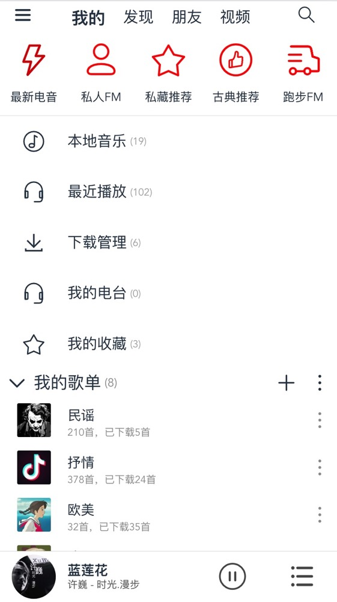
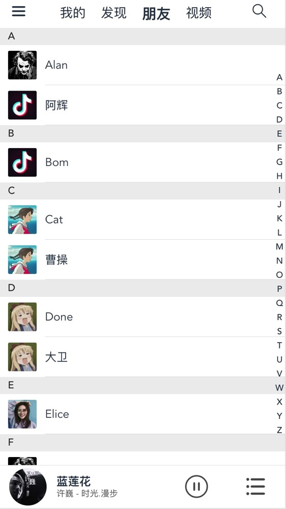
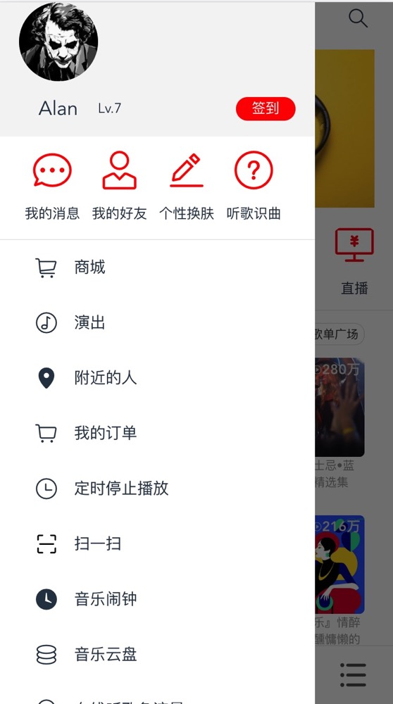

# music

> A Vue.js project

## 说明

### 一、本地启动网易云音乐的接口服务
接口文档：https://binaryify.github.io/NeteaseCloudMusicApi/#/?id=neteasecloudmusicapi
``` bash
git clone https://github.com/Binaryify/NeteaseCloudMusicApi
cd NeteaseCloudMusicApi
npm install
node app.js
```
### 二、启动项目
``` bash
git clone https://github.com/**
cd **
# install dependencies
npm install
# serve with hot reload at localhost:8081
npm run dev
# build for production with minification
npm run build
# publish
git checkout dev
npm run publish
```

## 三、演示地址
点击打开下方链接，手机端直接打开链接即可，pc端按**F12**进入开发者模式，调整为手机模式查看。  

[演示链接](https://alanyf.gitee.io/music)

## 四、技术栈
* **Vue**  
* **vue-router**   
* **vuex**  
* **webpack**  
* **vant** (vue移动端ui框架)

## 五、功能介绍  
    1. 前端页面中可通过`window.CURRENT_ENV`可以获取当前环境是开发环境还是生产环境(`build/htmlPlugin.js`)；
    2. 使用哈希路由模式不受后台路由限制，可以在生产环境打包后直接打开`index.html`运行或者发布到`gitHub.io`在线上运行；
    3. 在不能启动webpack服务器的情况下，使用webpack动态加载js，来实现前端读取mock数据（`src/utils/ajax-mock.js`）；在上方演示页面的github.io上就是使用了前端mock数据；
    4. 一个命令`npm run publish`自动编译和部署，
    
### 发布到`gitHub.io`的方法  
1. 本地在dev/mock目录下创建好需要用到的接口数据，mock数据存放目录结构和接口的path一致；
2. 生产环境打包：npm run build
3. 创建github项目，复制dist目录下的所有文件到github项目中，注意保证index.html在根目录下；
4. 发布到github page  
教程：  
    * [github.io](https://gitbook.tw/chapters/github/using-github-pages.html)  
    * [gitee.io](https://gitee.com/help/articles/4136#article-header3)  gitee是国内版的github，访问网速较快，因此我们使用的也是gitee page


## 六、页面介绍  
    1. 发现页面
    2. 我的页面
    3. 好友页面
    4. 视频页面
    5. 账户中心页
    6. 歌曲列表页
    7. 歌曲播放页
    8. 歌单广场页
    9. 歌单详情页
    10. 搜索页
    11. 底部当前播放列表页  

### 页面截图  
<style>
    .img-container{
        display:flex;
        width:100%;
        flex-wrap:wrap;
    }
    .img{
        width:300px!important;
        height:533px!important;
        margin: 5px;
    }
</style>

<div style="display:flex;width:100%;flex-wrap:wrap;" class="img-container">







</div>

# 优化记录
> 1. `(ok)`丰富本地mock数据，使项目在没有网易云api接口的情况下依然正常运行，最好可以自动判断运行环境，本地开发使用接口，线上使用mock（ajax-mock.js中import()实现前端动态加载mock数据）；  
> 2. `(ok)`play歌曲播放页架构优化，现在架构较为混乱，代码耦合性较高；  
> 3. `(ok)`当前还未使用vuex，计划使用vuex优化组件建通信和状态管理；  
> 4. `(ok)`评论页面、搜索页面；  
> 5. `(ok)`历史记录优化，由于现在歌曲播放页和列表页使用的方案是fixed布局，还不能与历史记录返回上一步相结合；  
> 6. `(ok)`ui框架逐步用移动端ui框架vant替换element-ui；  
> 7. `(ok)`生产环节打包，放置于github.io上访问测试；**怎么发上线？前端路由问题(前端路由使用hash模式)**
> 8.  `(ok)`webpack打包时自动搬运静态文件到static目录下；  
> 9. `(ok)`图片和长列表懒加载(视频页下拉刷新ok)
>    * `(ok)`骨架屏占位
>    * 1px边框问题、
>    * 横屏问题、
>    * 设备判断及兼容、
>    *  `(ok)`css实现在overflow时超出部分显示省略号... 
> 10. 整理移动端常见问题及解决方案；  
> 11.  `(ok)`本地移动端开发，可实时在手机上测试（静态页面可以，如何解决页面请求不到数据问题？）；
> 12. 缓存，前进刷新，后退不刷新
> 13. 使用slot插槽优化，能否抽象出常用组件，容器组件等
> 14. `(ok)`子路由刷新报404（服务器设置所有带music路径的请求都只想本项目的index.html，路由使用哈希模式）
> 15. `(ok)`自动构建发布，在dev分支上运行`npm run publish`开始自动`build`将文件打包到`dist`目录下，浏览器打开`index.html`即可访问。且自动`commit push`，完成后到github.io上发布即可完成发布。
